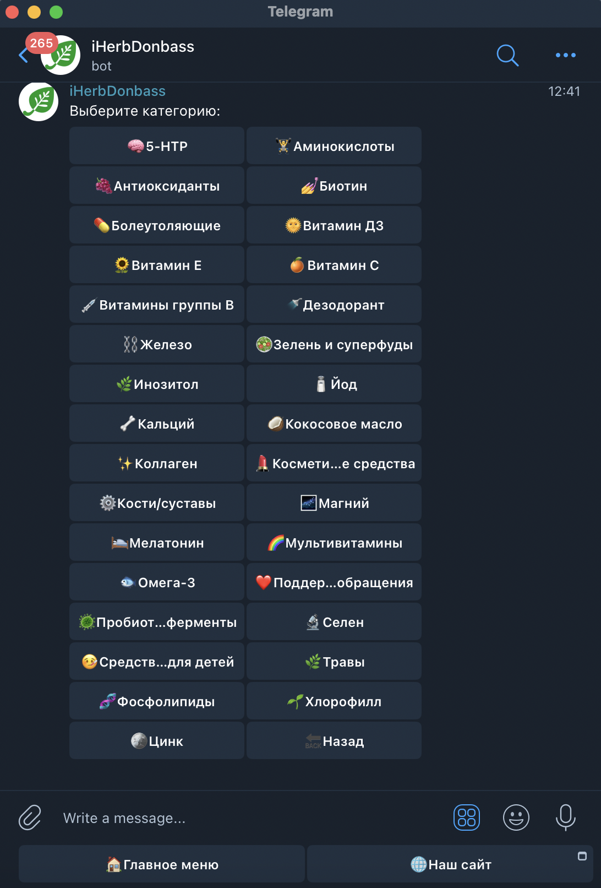
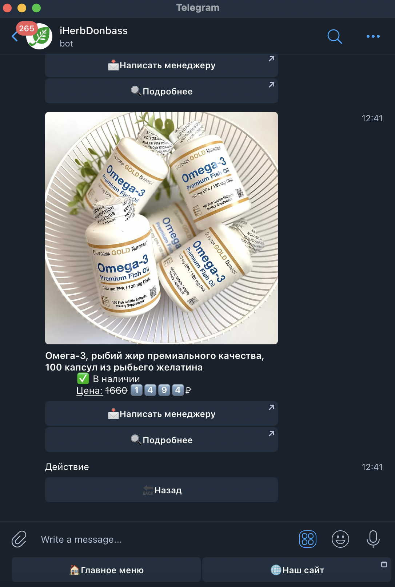

# iHerbDonbassBot

iHerbDonbassBot is an asynchronous chatbot for Telegram, designed to interact with users of the iHerbDonbass online store. The bot provides information about categories, brands and products available in the store, and also allows you to send a message to the manager.

<p align="center">


</p>

## Installation

1. Clone the repository:

```bash
git clone https://github.com/yourusername/iHerbDonbassBot.git
cd iHerbDonbassBot
```

2. Create a virtual environment and activate it:

```bash
python -m venv venv
source venv/bin/activate # for Windows: venv\Scripts\activate
```

3. Install dependencies:

```bash
pip install -r requirements.txt
```

4. Create a `.env` file and add the necessary environment variables to it:

```env
TOKEN=YOUR_TELEGRAM_BOT_TOKEN
API_BASE_URL=YOUR_API_BASE_URL
PRODUCTS_BASE_URL=YOUR_PRODUCTS_BASE_URL
ADMIN_USER_NAME=YOUR_ADMIN_USERNAME
```

## Usage

Run the bot:

```bash
python bot.py
```
The bot will be launched and will start processing user messages.